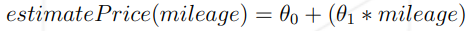
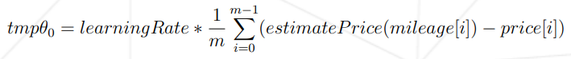
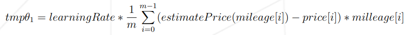
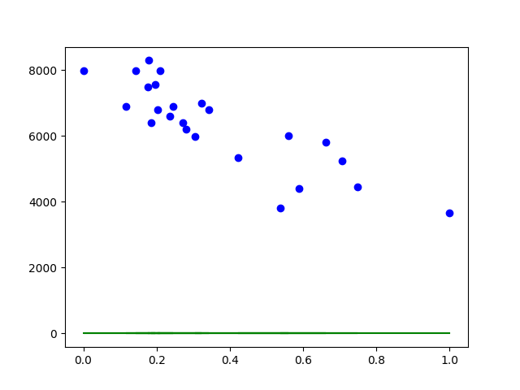
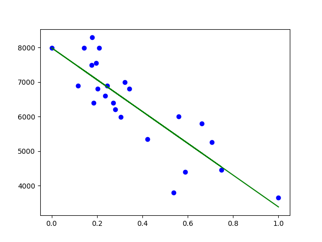
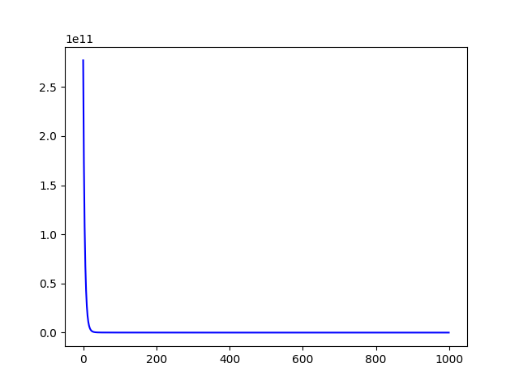

    

# ft_linear_regression

## Objective

The aim of this project is to introduce you to the basic concept behind machine learning.
For this project, you will have to create a program that predicts the price of a car by
using a [linear function](https://en.wikipedia.org/wiki/Linear_function) train with a [gradient descent algorithm](https://en.wikipedia.org/wiki/Gradient_descent).

- The first program will be used to predict the price of a car for a given mileage.
When you launch the program, it should prompt you for a mileage, and then give
you back the estimated price for that mileage. The program will use the following
hypothesis to predict the price :

    

Before the run of the training program, theta0 and theta1 will be set to 0.

- The second program will be used to train your model. It will read your dataset file
and perform a linear regression on the data.
Once the linear regression has completed, you will save the variables theta0 and
theta1 for use in the first program.
You will be using the following formulas :

    

    

## Result 

### Ploting DataSet

    

### After linear regression training

    

### Cost Function

    

